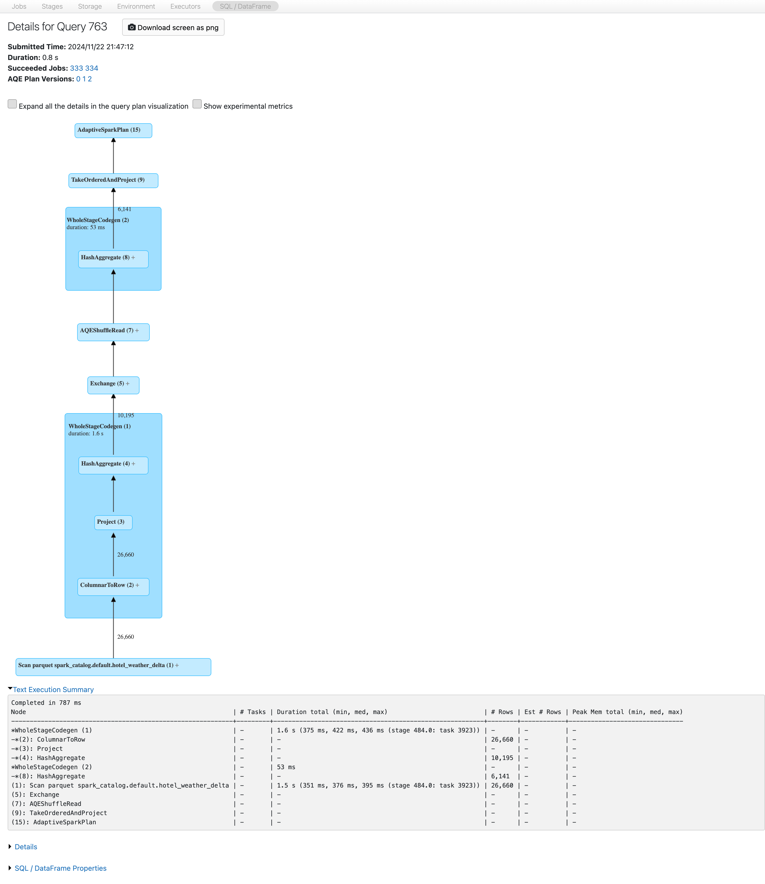
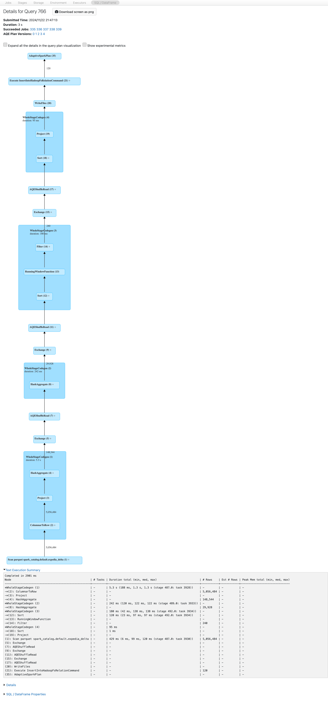

# Spark SQL Analytics Project: Advanced Data Processing and Cloud Optimization

The goal of this project is to perform advanced data processing and analytics tasks using **Spark SQL** within a cloud-integrated environment. Large-scale datasets will be analyzed, transformed, and stored while leveraging cloud services for scalability and efficient querying. The project focuses on creating Delta tables, analyzing data patterns, and optimizing storage through partitioning.

## Project Highlights

1. **Spark SQL Workflows**  
   Spark SQL queries will be designed and executed to process large datasets. Raw data will be transformed and stored in optimized formats.

2. **Cloud Integration**  
   Azure cloud platform will be used to manage data storage and support scalable analytics tasks. Resources will be provisioned and accessed efficiently.

3. **Data Analysis and Insights**  
   Complex analytics tasks will be carried out, including:  
   - Identifying hotels with the highest visit counts and temperature differences.  
   - Analyzing extended-stay trends, including average temperatures and day-to-day variations.  
   - Aggregating results by time periods and categories for actionable insights.  

4. **Data Cleansing and Enrichment**  
   Missing or inconsistent data will be addressed through cleansing operations. Enrichment techniques will be applied, ensuring datasets are comprehensive and ready for analysis.

5. **Storage Optimization**  
   Processed data will be stored in **Parquet** format, utilizing partitioning to optimize performance. This ensures efficient querying and scalability in a cloud-enabled setup.

6. **Infrastructure Automation**  
   - **Terraform**: Automated infrastructure provisioning will be carried out to set up cloud resources like storage accounts and compute clusters.  
   - **Databricks Notebooks**: Analytics workflows and visualizations will be executed in a collaborative, cloud-native environment.

---

## Prerequisites

Before starting, the following resources should be in place:

- **Cloud Platform Account**  
  A valid subscription to a cloud platform (Azure) for provisioning and managing resources.  

- **Terraform**  
  Installed and configured for automating cloud resource setup and management.

- **Databricks Environment**  
  Accessible environment for developing and running Spark SQL workflows.

---

## Expected Outcomes

By the end of the project, a comprehensive data analytics pipeline will be established that:  

- Processes raw datasets into structured, enriched outputs.  
- Delivers actionable insights through analytical queries and visualizations.  
- Stores results in optimized formats for long-term scalability and performance.  
- Implements best practices for cloud resource management and cost efficiency.

This project provides practical experience with Spark SQL, cloud infrastructure, and modern data analytics techniques, equipping participants to handle real-world data engineering challenges.


## Setup Instructions

### 1. Clone the Repository

The repository should first be forked to our GitLab account. Then, it can be cloned to our local machine using the following command:

```bash
git clone git@git.lab.com:abdullah_duman/sparksql_python_azure.git
cd sparksql_python_azure
```

### 2. Initialize Terraform

To set up the necessary cloud resources (storage account, compute resources, azure databricks service etc.), Terraform should be initialized and applied. First, we need to ensure that our Terraform configuration files are properly set up.

In the root directory of the project, the following command should be run to initialize Terraform:

 ```bash
terraform init
```


This command sets up the Terraform working directory and ensures that the necessary provider plugins for Azure are downloaded. It should be confirmed that Terraform configuration files (main.tf, variables.tf, etc.) are correctly set for Azure.

### 3. Create a Terraform Plan

After initialization, a Terraform plan can be created to preview the changes that will be made:

```bash
terraform plan 
````
This command generates an execution plan, which is saved to a file named terraform.plan. This file provides a preview of the resources that will be created or modified.


### 4. Apply the Terraform Plan

Once the plan has been reviewed, it can be applied to provision the specified resources:

```bash
terraform 
````

The saved plan will be used to create the resources as defined in the configuration.


Upon successful application, an Azure Resource Group, storage account, Azure Databricks Service connected to this resource group will be provisioned according to the Terraform configuration.


### 5. Upload Folder to Azure Storage

Once the Terraform resources have been successfully provisioned, the folder can be uploaded to the Azure storage container created in the previous steps.

The Azure Storage Explorer or the Azure CLI can be used for the upload. The storage container created in Terraform is named `sparksql`, and the storage account is `stsparksqlnortheurope`.

To upload the folder, the following steps should be followed:

1. **Azure Storage Explorer** should be opened to connect to the storage account.
2. The `stsparksqlnortheurope` storage account should be navigated to, and then the `sparksql` container should be opened.
3. The desired folder from the local machine should be uploaded to the container.


### 6. Configuring Spark Settings in Databricks

To enable secure interaction between Azure Databricks and the Azure storage account, a **secret scope** was created to manage sensitive information, and Spark configurations were applied accordingly. This ensured that no sensitive details were exposed in the workspace.

---

#### **1. Installing Databricks CLI and Configuring the Token**

1. **Install Databricks CLI**  
   The Databricks CLI was installed to manage Databricks resources and create secret scopes:
   ```bash
   pip install databricks-cli
   ````

2. **Generate a Personal Access Token** 

    A **Personal Access Token** was generated from the Azure Databricks workspace by following these steps:

    1. Navigate to **User Settings** in the Databricks workspace.
    2. Under **Access Tokens**, click on **Generate New Token**.
    3. The token was securely copied and stored for later use.

3. **Configure Databricks CLI** 

    After the token was generated, the **Databricks CLI** was configured using the following steps:

    1. The configuration command was run in the terminal:
        ```bash
        databricks configure --token
        ```
    2. The following details were entered when prompted:

        - **Databricks Host:** The URL of the Databricks workspace, for example:
        ```python
        https://<databricks-instance>.azuredatabricks.net
        ```
        - **Token:** The previously generated Personal Access Token.

#### **2. Creating the Secret Scope**

1. **Generate Azure Active Directory Token** 

    A **service principal** was created in **Azure Active Directory** to provide secure access to the storage account. The following details were obtained for the service principal:

    - **Client ID**
    - **Client Secret**
    - **Tenant ID**

    Using these details, an **OAuth token** was dynamically generated during authentication. This token facilitated secure communication between Databricks and Azure.

2. **Create a Secret Scope** 

    In the Databricks workspace, the `apo-secrets` secret scope was created using the Databricks CLI with the following command:

    ```bash
    databricks secrets create-scope --scope apo-secrets
    ```
    The credentials were securely added to the secret scope using the following commands:

    ```bash
    databricks secrets put --scope apo-secrets --key client-id
    databricks secrets put --scope apo-secrets --key client-secret
    ```
#### **3. Spark Configuration Details**

The following Spark configurations were applied to establish a connection to the Azure storage account:

```plaintext
spark.hadoop.fs.azure.account.auth.type.stsparksqlnortheurope.dfs.core.windows.net OAuth
spark.hadoop.fs.azure.account.oauth.provider.type.stsparksqlnortheurope.dfs.core.windows.net org.apache.hadoop.fs.azurebfs.oauth2.ClientCredsTokenProvider
spark.hadoop.fs.azure.account.oauth2.client.id.stsparksqlnortheurope.dfs.core.windows.net {{secrets/apo-secrets/client-id}}
spark.hadoop.fs.azure.account.oauth2.client.secret.stsparksqlnortheurope.dfs.core.windows.net {{secrets/apo-secrets/client-secret}}
spark.master local[*]
spark.databricks.cluster.profile singleNode
```

---

#### **4. Assigning Roles to the Service Principal**

To enable the service principal (`apo_service_principal`) to access the Azure Storage Account, the required roles were assigned. These roles provided the necessary permissions for interacting with the blob storage.

#### **Role Assignments**

The following roles were assigned to the service principal:

1. **Storage Blob Data Reader**  
   This role allowed the service principal to read data from the blob storage.

2. **Storage Blob Data Contributor**  
   This role permitted the service principal to read, write, and delete data in the blob storage.

#### **Steps to Assign Roles**

1. The **Azure Portal** was opened, and the **Storage Account** (`stsparksqlnortheurope`) was selected.
2. The **Access Control (IAM)** section of the storage account was accessed.
3. The **Add Role Assignment** option was selected, and the following actions were performed:
   - **Role**: `Storage Blob Data Reader` or `Storage Blob Data Contributor` was chosen from the list.
   - **Assign Access To**: `User, group, or service principal` was selected.
   - **Select Members**: The service principal (`apo_service_principal`) was searched for and selected.
   - The assignment was confirmed by clicking **Save**.

4. This process was repeated to ensure that both roles were assigned to the service principal.

---

### Verification of Role Assignments

To confirm that the roles had been successfully assigned:

1. The **Azure Portal** was opened, and the **Storage Account** was selected.
2. The **Access Control (IAM)** section was reviewed under the **Role Assignments** tab.
3. It was verified that the service principal appeared under both the `Storage Blob Data Reader` and `Storage Blob Data Contributor` roles.

By assigning these roles, secure interaction between the service principal and the Azure Blob Storage container was ensured.


### Azure Databricks Cluster Configuration

The computational tasks for this project were executed on a custom Azure Databricks cluster specifically configured to meet the project requirements. Below is a detailed explanation of the cluster configuration and its purpose.

#### **Cluster Details**


- **Cluster Name**: Spark SQL Cluster  
  This cluster was created to handle all Spark jobs and data-related tasks for the project.  

- **Cluster Mode**: Single User  
  The cluster was configured in **single user mode**, meaning only one user had access to this cluster for enhanced security and control.

- **Access Mode**: Single User Access  
  Only **Abdullah DUMAN** had the permission to access and manage this cluster.  

---

#### **Performance Settings**

The following settings were applied to ensure the cluster had adequate resources to process and analyze data efficiently:

- **Databricks Runtime Version**:  
  - **Version**: `12.2 LTS`  
    - Includes Apache Spark 3.3.2 and Scala 2.12.  
    - This version ensured compatibility with the latest features and bug fixes while providing long-term support for stability.  

- **Photon Acceleration**: Enabled  
  - The **Photon Engine** is a vectorized query engine that accelerated SQL and Spark queries, reducing computation time and cost.  

- **Node Type**:  
  - **Standard_DS3_v2**  
    - Specifications: 14 GB Memory, 4 Cores.  
    - Suitable for small to medium workloads, this node type was chosen for its balance of compute power and cost efficiency.  

- **Termination Time**: 120 minutes of inactivity  
  - The cluster was configured to terminate automatically after 120 minutes of inactivity.  
  - This feature minimized unnecessary costs by shutting down the cluster when not in use.  

- **Driver Configuration**:  
  - **1 Driver Node**  
    - Specifications: 14 GB Memory, 4 Cores.  
    - The driver managed job execution and coordination among worker nodes.  

- **DBU Rate**: 0.75 DBU/hour  
  - A Databricks Unit (DBU) is a unit of processing capability per hour.  
  - At 0.75 DBU/hour, the cluster offered an economical solution for running data workflows.  

---

#### **Cluster Summary**

| **Configuration Aspect** | **Details**                               |
|---------------------------|-------------------------------------------|
| **Cluster Name**          | Spark SQL Cluster                 |
| **Runtime Version**       | `12.2 LTS (Apache Spark 3.3.2, Scala 2.12)` |
| **Node Type**             | `Standard_DS3_v2` (14 GB Memory, 4 Cores)|
| **Termination Time**      | 120 minutes of inactivity                |
| **Photon Acceleration**   | Enabled                                  |
| **DBU Rate**              | 0.75 DBU/hour                            |

---

#### **Cluster Usage**

The cluster was employed for several critical tasks, including:

1. **Connecting to Azure Blob Storage**:  
   - The cluster was configured to authenticate securely with Azure Blob Storage using the previously set up secret scope and Spark configurations.  

2. **Reading and Writing Data**:  
   - The data stored in Azure Blob Storage was read into Databricks for further processing.  
   - Processed data was written back to storage or saved locally for validation.

3. **Data Transformations and Analysis**:  
   - Various Spark jobs were executed to perform ETL (Extract, Transform, Load) operations on the data.  
   - Transformations included filtering, aggregations, and data cleaning.  

4. **Testing and Validation**:  
   - The cluster was also used to test the configurations, ensuring smooth and secure interaction between Databricks and Azure services.  

---

#### **Cluster Policy**

The cluster adhered to the **Personal Compute Policy**, which ensured that the configurations were specific to the individual user's requirements while maintaining secure access. This policy limited access to one user and streamlined management for single-user workloads.

---

### 7. Creating Spark SQL Notebook 

#### 1. Loading the Expedia and Hotel Weather Datasets

This section describes how the Expedia and Hotel Weather datasets are loaded into temporary views for querying and analysis. These views serve as the foundation for subsequent data processing steps.

##### 1.1 Loading the Expedia Dataset

The **Expedia dataset** contains information about user bookings, including hotel IDs, search criteria, and booking dates. The dataset is stored in **Avro format** and is loaded into a temporary view called `expedia`.

##### Steps:
1. Use the `CREATE OR REPLACE TEMPORARY VIEW` statement to load the dataset from the Azure Data Lake storage.
2. Query the dataset to verify its contents by displaying the first 10 rows.

##### Query:
```sql
-- Load the Expedia dataset and create a temporary view
CREATE OR REPLACE TEMPORARY VIEW expedia AS
SELECT * FROM avro.`abfss://data@stsparksqlnortheurope.dfs.core.windows.net/expedia/`;

-- Display the first 10 rows of the Expedia dataset
SELECT * FROM expedia LIMIT 10;
```


##### 1.2 Loading the Hotel Weather Dataset

The Hotel Weather dataset contains weather information for various hotels, including average temperatures, city names, and geographical data. It is stored in Parquet format, partitioned by year, month, and day, and is loaded into a temporary view called hotel_weather.

##### Steps:

1. Use the `CREATE OR REPLACE TEMPORARY VIEW` statement to load the dataset from the Azure Data Lake storage.
2. Query the dataset to verify its contents by displaying the first 10 rows.

##### Query:
```sql
-- Load the Hotel Weather dataset into a temporary view
CREATE OR REPLACE TEMPORARY VIEW hotel_weather AS
SELECT * FROM parquet.`abfss://data@stsparksqlnortheurope.dfs.core.windows.net/hotel-weather/year*/month*/day*/`;

-- Display the first 10 rows of the Hotel Weather dataset
SELECT * FROM hotel_weather LIMIT 10;
```


## 2. Creating Delta Tables for Expedia and Hotel Weather Data in New Locations

This document provides the steps to create and manage Delta tables for two datasets: `Expedia` and `Hotel Weather`. These steps demonstrate how to store and query the data effectively in a Delta Lake format.

---

### **1. Setting Up Delta Table for Expedia Data**

#### **Step 1: Dropping the Existing Delta Table**
If the Delta table already exists, drop it to ensure the creation of a fresh table.

```sql
DROP TABLE IF EXISTS expedia_delta;
```
#### **Step 2: Creating the Delta Table**

Create a Delta table at the specified storage location by using the data from the expedia table.

```sql
CREATE TABLE IF NOT EXISTS expedia_delta
USING DELTA
LOCATION 'abfss://data@stsparksqlnortheurope.dfs.core.windows.net/deltatables/expedia_delta/'
AS
SELECT * FROM expedia;
```
#### **Step 3: Inserting Datae**

Insert additional data into the Delta table as needed.

```sql
INSERT INTO expedia_delta
SELECT * FROM expedia;
```

#### **Step 4: Querying the Delta Table**

Perform queries to verify the data in the table.

```sql
SELECT * FROM expedia_delta LIMIT 10;
```


#### **Step 5: Describing the Table**

Describe the table to review its schema.

```sql
DESCRIBE TABLE expedia_delta;
```


### **2. Setting Up Delta Table for Hotel Weather Data**

#### **Step 1: Dropping the Existing Delta Table**

Similar to the Expedia table, drop the existing Hotel Weather Delta table if it exists.

```sql
DROP TABLE IF EXISTS hotel_weather_delta;
```
#### **Step 2: Creating the Delta Table**
Create the Hotel Weather Delta table at the specified location.

```sql
CREATE TABLE IF NOT EXISTS hotel_weather_delta
USING DELTA
LOCATION 'abfss://data@stsparksqlnortheurope.dfs.core.windows.net/deltatables/hotel_weather_delta/'
AS
SELECT * FROM hotel_weather;
```
#### **Step 3: Inserting Data**

```sql
INSERT INTO hotel_weather_delta
SELECT * FROM hotel_weather;
```

#### **Step 4: Querying the Delta Table**

Query the Delta table to verify the data.

```sql
SELECT * FROM hotel_weather_delta LIMIT 10;
```


#### **Step 5: Describing the Table**

Describe the table schema to confirm the column definitions.

```sql
DESCRIBE TABLE hotel_weather_delta;
```


**Notes**
- Ensure all Azure Data Lake storage locations are accessible and correctly configured.
- Delta tables provide ACID compliance, making them suitable for handling complex data pipelines.
- Use SELECT statements to validate data integrity after each operation.


## 3. Identifying Top 10 Hotels with the Highest Monthly Temperature Variations

This SQL script identifies the top 10 hotels with the largest temperature variations for each month by analyzing weather data and stores the results in a Parquet table.

### **SQL Code**

```sql
EXPLAIN
-- Create the Parquet table if it does not exist in the 'datamarts' folder
CREATE TABLE IF NOT EXISTS hotel_temp_diff_by_month_parquet (
    hotel_id STRING,
    wthr_month INT,
    max_temp DOUBLE,
    min_temp DOUBLE,
    temp_diff DOUBLE
)
USING PARQUET
LOCATION 'abfss://data@stsparksqlnortheurope.dfs.core.windows.net/datamarts/hotel_temp_diff_by_month_parquet/';

-- Insert query results into the Parquet table
INSERT INTO hotel_temp_diff_by_month_parquet
SELECT
    id AS hotel_id,
    MONTH(TO_DATE(wthr_date, 'yyyy-MM-dd')) AS wthr_month,
    MAX(avg_tmpr_c) AS max_temp,
    MIN(avg_tmpr_c) AS min_temp,
    ROUND(MAX(avg_tmpr_c) - MIN(avg_tmpr_c), 1) AS temp_diff
FROM hotel_weather_delta
GROUP BY id, MONTH(TO_DATE(wthr_date, 'yyyy-MM-dd'))
ORDER BY temp_diff DESC
LIMIT 10;

-- Display the same result
SELECT
    id AS hotel_id,
    MONTH(TO_DATE(wthr_date, 'yyyy-MM-dd')) AS wthr_month,
    MAX(avg_tmpr_c) AS max_temp,
    MIN(avg_tmpr_c) AS min_temp,
    ROUND(MAX(avg_tmpr_c) - MIN(avg_tmpr_c), 1) AS temp_diff
FROM hotel_weather_delta
GROUP BY id, MONTH(TO_DATE(wthr_date, 'yyyy-MM-dd'))
ORDER BY temp_diff DESC
LIMIT 10;
```

### **Output**


## 4. Top 10 Most Visited Hotels Per Month: Accounting for Multi-Month Stays

This script identifies the top 10 hotels with the highest visit counts for each month, considering guests with multi-month stays.


### **SQL Code**

```sql
EXPLAIN
-- Create the table if it does not exist in the 'datamarts' folder, using Parquet format
CREATE TABLE IF NOT EXISTS top_10_hotels_by_visits (
    hotel_id STRING,
    visit_year INT,
    visit_month INT,
    visit_count INT
)
USING PARQUET
LOCATION 'abfss://data@stsparksqlnortheurope.dfs.core.windows.net/datamarts/top_10_hotels_by_visits/';

-- Insert query results into the Parquet table
INSERT INTO top_10_hotels_by_visits
WITH monthly_visits AS (
    SELECT
        hotel_id,
        EXTRACT(YEAR FROM date_time) AS visit_year,
        EXTRACT(MONTH FROM date_time) AS visit_month,
        COUNT(*) AS visit_count
    FROM expedia_delta
    GROUP BY hotel_id, visit_year, visit_month
),
ranked_visits AS (
    SELECT
        hotel_id,
        visit_year,
        visit_month,
        visit_count,
        ROW_NUMBER() OVER (PARTITION BY visit_year, visit_month ORDER BY visit_count DESC) AS rank
    FROM monthly_visits
)
SELECT
    hotel_id,
    visit_year,
    visit_month,
    visit_count
FROM ranked_visits
WHERE rank <= 10
ORDER BY visit_year, visit_month, rank;

-- Display the same result
WITH monthly_visits AS (
    SELECT
        hotel_id,
        EXTRACT(YEAR FROM date_time) AS visit_year,
        EXTRACT(MONTH FROM date_time) AS visit_month,
        COUNT(*) AS visit_count
    FROM expedia_delta
    GROUP BY hotel_id, visit_year, visit_month
),
ranked_visits AS (
    SELECT
        hotel_id,
        visit_year,
        visit_month,
        visit_count,
        ROW_NUMBER() OVER (PARTITION BY visit_year, visit_month ORDER BY visit_count DESC) AS rank
    FROM monthly_visits
)
SELECT
    hotel_id,
    visit_year,
    visit_month,
    visit_count
FROM ranked_visits
WHERE rank <= 10
ORDER BY visit_year, visit_month, rank;
```

### **Sample Output**


## 5. Creating and Saving Joined Hotel and Expedia Data as a Parquet Table

This script combines hotel weather data with Expedia booking data, saves the result as a Parquet table, and displays a sample.

### **SQL Code**

```sql
EXPLAIN
-- Step 1: Create a temporary view with renamed column
CREATE OR REPLACE TEMP VIEW joined_data_temp AS
SELECT
    hw.*,
    ed.hotel_id,
    ed.date_time,
    ed.site_name,
    ed.posa_continent,
    ed.user_location_country,
    ed.user_location_region,
    ed.user_location_city,
    ed.orig_destination_distance,
    ed.user_id,
    ed.is_mobile,
    ed.is_package,
    ed.channel,
    ed.srch_ci,
    ed.srch_co,
    ed.srch_adults_cnt,
    ed.srch_children_cnt,
    ed.srch_rm_cnt,
    ed.srch_destination_id,
    ed.srch_destination_type_id,
    ed.id AS expedia_id
FROM hotel_weather_delta hw
JOIN expedia_delta ed
    ON hw.id = ed.hotel_id
WHERE hw.id RLIKE '^[0-9]+$'
    AND LENGTH(hw.id) > 0;

-- Step 2: Create the schema if it does not exist
CREATE SCHEMA IF NOT EXISTS datamarts;

-- Step 3: Set the configuration to allow non-empty location in CTAS
SET spark.sql.legacy.allowNonEmptyLocationInCTAS = true;

-- Step 4: Save the result as a Parquet file in the 'datamarts' folder
DROP TABLE IF EXISTS datamarts.joined_hotel_data;

CREATE TABLE datamarts.joined_hotel_data
USING PARQUET
LOCATION 'abfss://data@stsparksqlnortheurope.dfs.core.windows.net/datamarts/joined_hotel_data/'
AS
SELECT * FROM joined_data_temp;

-- Step 5: Display the first 10 rows of the saved Parquet file
SELECT *
FROM datamarts.joined_hotel_data
LIMIT 10;
```

### **Sample Output**


## 6. Creating and Saving Joined Hotel and Expedia Data as a Parquet Table

This SQL script examines long hotel stays (over 7 days) by analyzing weather trends, average temperatures, and temperature changes throughout the stay period.

### **SQL Code**

```sql
-- The WITH clause creates a Common Table Expression (CTE) to pre-filter the data for stays longer than 7 days.
-- This improves readability and modularizes the query, making it easier to manage complex logic.
WITH filtered_data AS (
    SELECT 
        j.user_id,
        j.srch_ci,
        j.srch_co,
        DATEDIFF(j.srch_co, j.srch_ci) AS stay_duration  -- Calculate the length of stay in days
    FROM joined_hotel_data AS j
    WHERE j.srch_ci IS NOT NULL  -- Include only rows with a valid check-in date
      AND j.srch_co IS NOT NULL  -- Include only rows with a valid check-out date
      AND DATEDIFF(j.srch_co, j.srch_ci) > 7  -- Filter for stays longer than 7 days
)
SELECT
    f.user_id,
    f.srch_ci,
    f.srch_co,
    f.stay_duration,
    -- Average temperature on the first day of the stay
    ROUND(MAX(CASE WHEN w.wthr_date = f.srch_ci THEN w.avg_tmpr_c END), 1) AS first_day_avg_temp,
    -- Average temperature on the last day of the stay
    ROUND(MAX(CASE WHEN w.wthr_date = f.srch_co THEN w.avg_tmpr_c END), 1) AS last_day_avg_temp,
    -- Weather trend: Temperature difference between the last and first day
    ROUND(MAX(CASE WHEN w.wthr_date = f.srch_co THEN w.avg_tmpr_c END) 
        - MAX(CASE WHEN w.wthr_date = f.srch_ci THEN w.avg_tmpr_c END), 1) AS weather_trend,
    -- Average temperature during the entire stay
    ROUND(AVG(w.avg_tmpr_c), 1) AS avg_temp_during_stay
FROM filtered_data AS f
LEFT JOIN joined_hotel_data AS w
    ON f.user_id = w.user_id  -- Join by user ID to associate weather data with each user's stay
    AND w.wthr_date BETWEEN f.srch_ci AND f.srch_co  -- Only include weather data within the stay period
GROUP BY f.user_id, f.srch_ci, f.srch_co, f.stay_duration  -- Group by user and stay details
HAVING first_day_avg_temp IS NOT NULL  -- Ensure there is valid weather data for the first day
   AND last_day_avg_temp IS NOT NULL;  -- Ensure there is valid weather data for the last day
```

### **Sample Output**


## EXECUTION PLAN

### 1. Identifying Top 10 Hotels with the Highest Monthly Temperature Variations

The execution plan for retrieving the **top 10 hotels with the highest monthly temperature variations** was analyzed. The query involved **4 jobs** across two parts, with operations mapped to corresponding query steps.


<div style="display: flex; justify-content: space-between;">
    
    
</div>
<br>
<br>
<br>

<div style="display: flex; justify-content: space-between;">
    
    
</div>

## Key Metrics

<br>

| **Metric**                  | **Value**            |
|-----------------------------|----------------------|
| Total Execution Time         | 2.133 seconds       |
| Number of Jobs               | 4                   |
| Rows Scanned                 | 26,660              |
| Rows After Aggregation       | 10,195              |
| Rows Written (Final Output)  | 10                  |

---

## Summary of Execution Times

### Part 1
1. **Scan Operation**: 
   - Table: `hotel_weather_delta`
   - Time: **1.2 seconds**
   - Rows Processed: **26,660**

2. **Hash Aggregation**:
   - Time: Included in overall **1.8 seconds** of stage processing.
   - Rows Aggregated: **10,195**

3. **Shuffle (Exchange)**:
   - Data redistribution across cluster nodes.
   - Time: Distributed across intermediate stages.

4. **Write Operation**:
   - Final results written to storage.
   - Time: Minimal, not explicitly measured.

### Part 2
1. **Scan Operation**:
   - Time: **1.5 seconds**
   - Rows Processed: **26,660**

2. **Final Aggregation**:
   - Time: Included in **1.6 seconds** of processing.
   - Rows Aggregated: **6,141**

3. **Projection and Output**:
   - Top 10 results retrieved.
   - Rows Written: **10**

---

### Execution Insights
The **Exchange (Shuffle)** and **Hash Aggregation** steps were identified as the most resource-intensive, contributing significantly to execution time. A total of **26,660 rows** were scanned and progressively reduced to the final **10 rows**, highlighting the computational effort required for aggregation and sorting operations.

### 2. Top 10 Most Visited Hotels Per Month (Accounting for Multi-Month Stays)

The execution plan for retrieving the **top 10 most visited hotels per month**, while accounting for **multi-month stays**, involved **2 parts** with a total of **8 jobs**. Below is the detailed breakdown of execution times, operations, and resources used.


<div style="display: flex; justify-content: space-between;">
    
    
</div>
<br>
<br>
<br>

<div style="display: flex; justify-content: space-between;">
    
    
</div>

---

## Key Metrics

| **Metric**                  | **Value**            |
|-----------------------------|----------------------|
| Total Execution Time         | 4.752 seconds        |
| Number of Jobs               | 8                    |
| Rows Scanned                 | 10,113,968           |
| Rows After Aggregation       | 178,472              |
| Rows Written (Final Output)  | 120                  |

---

## Summary of Execution Times

### Part 1
1. **Scan Operation**: 
   - Table: `expedia_delta`
   - Time: **429 ms**
   - Rows Processed: **5,056,484**

2. **Hash Aggregation**:
   - Time: **1.8 seconds** (across multiple stages)
   - Rows Aggregated: **148,544**

3. **Exchange (Shuffle)**:
   - Data redistribution across cluster nodes.
   - Time: Distributed across intermediate stages.

4. **Write Operation**:
   - Final results written to storage.
   - Time: Minimal, not explicitly measured.

5. **Total Time for Part 1**: **2.901 seconds**

### Part 2
1. **Scan Operation**: 
   - Time: **1.2 seconds**
   - Rows Processed: **5,056,484**

2. **Hash Aggregation**:
   - Time: **1.6 seconds**
   - Rows Aggregated: **148,544**

3. **Final Projection**:
   - Top 120 results retrieved.
   - Rows Written: **120**

4. **Total Time for Part 2**: **1.851 seconds**

---

## Execution Insights

- **Scan Operation**: The query processed **5,056,484 rows** during the scan of the `expedia_delta` table in both parts, indicating a significant amount of data was handled throughout the process.
- **Hash Aggregation & Exchange (Shuffle)**: These operations were particularly resource-intensive. The data was shuffled multiple times across the cluster, contributing to the total execution time.
- **Row Reduction**: Through aggregation and filtering steps, the total rows processed in the scan were reduced to **120 rows**, indicating a focused effort on retrieving the most relevant hotels per month.
- **Overall Execution Time**: The total execution time across all jobs was **4.752 seconds**, with the final output of **120 rows** showing the most visited hotels per month while accounting for multi-month stays.

This analysis highlights the complexity of accounting for multi-month stays, especially as it involves handling large datasets, performing aggregations, and distributing data across different cluster nodes.

### 3. Analyzing Long Stays: Weather Trends and Average Temperatures for Stays Exceeding 7 Days

The execution plan for analyzing long stays, particularly focusing on weather trends and average temperatures for stays exceeding **7 days**, involves **1 part** and **4 jobs**. Below is the breakdown of the execution times, operations, and resources used.


<div style="display: flex; justify-content: space-between;">
    
    
</div>

---

## Key Metrics

| **Metric**                  | **Value**            |
|-----------------------------|----------------------|
| Total Execution Time         | 9.208 seconds        |
| Number of Jobs               | 4                    |
| Rows Scanned                 | 13,515,751           |
| Rows After Filter            | 2,738                |
| Rows Aggregated              | 52,105               |
| Final Rows Written (Output)  | 20                   |

---

## Summary of Execution Times

### Job Breakdown

1. **Job 1: ColumnarToRow (1st Stage)**
   - **Scan Operation**: Reads data from `spark_catalog.default.joined_hotel_data`.
   - **Time**: **1.1 seconds**
   - **Rows Processed**: **13,515,751**
   
2. **Job 2: ColumnarToRow (2nd Stage)**
   - **Filter Operation**: Filters rows to focus on stays exceeding 7 days.
   - **Time**: **2.6 seconds**
   - **Rows Processed**: **13,515,751** (original rows), reduced to **298,265** after filter.
   
3. **Job 3: SortMergeJoin & Aggregation**
   - **Join Operation**: Sorting and merging data related to weather trends and stays.
   - **Time**: **7.1 seconds**
   - **Rows Processed**: **1,260,785** during the join.
   - **Hash Aggregation**: Results in **52,105** aggregated rows.

4. **Job 4: Final Projection & Limit**
   - **Final Projection**: Selects the top 20 rows.
   - **Time**: **132 ms**
   - **Rows Processed**: **2,738** after filtering, **20 rows** written as the final result.

---

## Execution Insights

- **Scan Operation**: The query processed **13,515,751 rows** across both stages during the scan, showcasing significant data handling.
- **Filter Operation**: After applying the filter for stays exceeding 7 days, the dataset was reduced to **298,265 rows**.
- **Join and Aggregation**: Sorting, merging, and aggregating weather data and stay details took the longest time (**7.1 seconds**). The final number of rows after aggregation was **52,105**.
- **Final Projection**: Only the **top 20 results** were selected, ensuring that the query output was focused on the most relevant data, specifically for long stays exceeding 7 days.

### Execution Breakdown:

| **Node**                     | **Duration** (Total, Min, Max) | **Rows Processed** | **Peak Memory**         |
|------------------------------|--------------------------------|--------------------|-------------------------|
| WholeStageCodegen (1)         | 7.2 s (347 ms, 1.7 s, 1.8 s)   | 13,515,751         | Not measured            |
| ColumnarToRow (1)             | -                              | 13,515,751         | -                       |
| Filter (1)                    | -                              | 298,265            | -                       |
| WholeStageCodegen (2)         | 11.6 s (671 ms, 2.6 s, 2.9 s)  | 13,515,751         | -                       |
| ColumnarToRow (2)             | -                              | 13,515,751         | -                       |
| Filter (2)                    | -                              | 13,515,751         | -                       |
| WholeStageCodegen (3)         | 7.1 s (1.7 s, 1.8 s, 1.8 s)    | 1,260,785          | -                       |
| SortMergeJoin                 | -                              | 1,260,785          | -                       |
| HashAggregate                 | -                              | 52,105             | -                       |
| Final Projection & Limit      | 132 ms                         | 2,738              | -                       |

---

## Performance Considerations

- **Execution Time**: The total execution time of **9.208 seconds** is spread across 4 jobs, indicating the query handled a large dataset and required significant filtering, joining, and aggregation.
- **Memory Utilization**: The query did not report specific peak memory usage, but the substantial number of rows involved suggests that memory management was crucial in optimizing execution.
- **Optimized Performance**: The use of efficient data filtering, sorting, and aggregation strategies enabled the system to reduce the rows from over **13 million** to just **20** in the final result.

This analysis highlights the complexity of analyzing long stays while incorporating weather data and temperature trends, ensuring the query execution was optimized for large datasets and multi-step operations.


### Analyzing Long Stays: A Time-Intensive Query with Efficient Data Reduction


The most time-consuming query among the three is Analyzing Long Stays: Weather Trends and Average Temperatures for Stays Exceeding 7 Days, which took a total execution time of 9.208 seconds across 4 jobs. This query involved processing a massive dataset, with 13,515,751 rows scanned in the initial stages. The key resource-intensive steps included sorting, merging, and aggregating data, which contributed significantly to the execution time. Despite the large dataset, the query was able to efficiently reduce the rows down to just 20 in the final output, showcasing the effectiveness of its filtering and aggregation techniques. The complexity of managing weather data alongside long stays and aggregating this information while keeping memory usage optimized makes this query the most demanding in terms of execution time and resources.

## Result of Execution Plans

The most time-consuming query among the three is **Analyzing Long Stays: Weather Trends and Average Temperatures for Stays Exceeding 7 Days**, which took a total execution time of **9.208 seconds** across **4 jobs**. This query involved processing a massive dataset, with **13,515,751 rows** scanned in the initial stages. The key resource-intensive steps included sorting, merging, and aggregating data, which contributed significantly to the execution time. Despite the large dataset, the query was able to efficiently reduce the rows down to just **20** in the final output, showcasing the effectiveness of its filtering and aggregation techniques. The complexity of managing weather data alongside long stays and aggregating this information while keeping memory usage optimized makes this query the most demanding in terms of execution time and resources.


## Terraform Project Cleanup

### Overview

At the end of the project, the resources created by Terraform should be cleaned up. This can be done by using the `terraform destroy` command. The command ensures that all the infrastructure and configurations are removed from the cloud provider, leaving no resources behind.

## Destroying Resources

Once the project is completed, the following command should be used to destroy all resources:


```bash
terraform destroy
```

The command will prompt for confirmation to proceed with the destruction of all infrastructure resources defined in the configuration files. Once confirmed, Terraform will remove all the resources it created, ensuring that the environment is fully cleaned up.


## Conclusion

In conclusion, this project successfully utilized **Databricks** and **Spark SQL** to analyze hotel and weather data, leveraging **Delta Lake** for efficient data management. By identifying key trends, such as the relationship between temperature differences and hotel visit counts, as well as weather preferences for extended stays, valuable insights were gained. Storing the data in partitioned **Parquet** format within a resilient storage account ensured both performance and long-term availability. 

Overall, the project demonstrates the power of scalable analytics and efficient data storage solutions in deriving actionable insights from large datasets.
